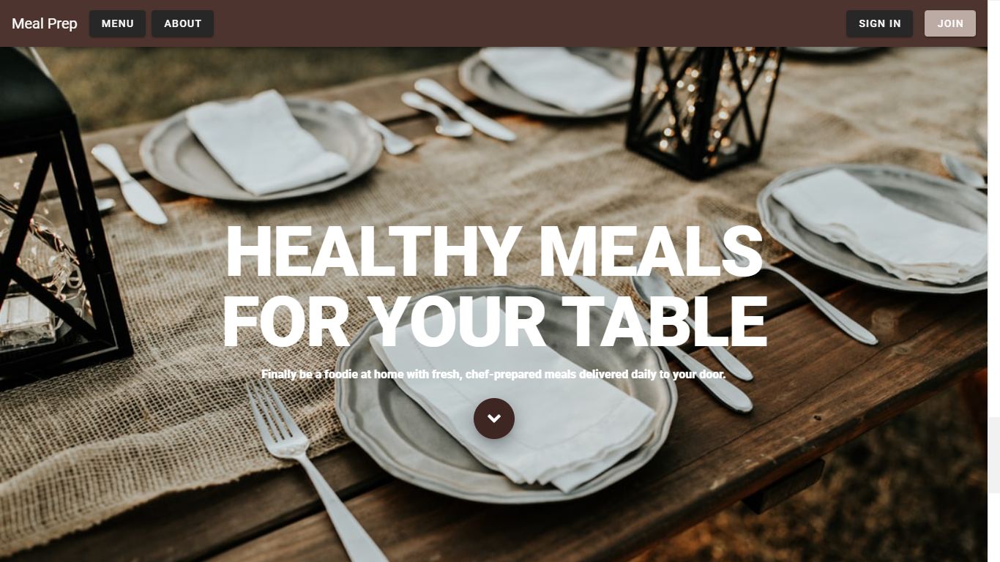

<h1 align="center">
   Meal Prep
</h1>

  <a href="#-tecnologias">Tecnologias</a>&nbsp;&nbsp;&nbsp;|&nbsp;&nbsp;&nbsp;
  <a href="#-projeto">Projeto</a>&nbsp;&nbsp;&nbsp;|&nbsp;&nbsp;&nbsp;
  <a href="#-layout">Layout</a>&nbsp;&nbsp;&nbsp;|&nbsp;&nbsp;&nbsp;
  <a href="#memo-licença">Licença</a>

 

  

 

  

## 🚀 Tecnologias

Esse projeto foi desenvolvido com as seguintes tecnologias:

- [Vue.js](https://nodejs.org/en/)
- [Vuetify](https://reactjs.org)

## 💻 Projeto

O Meal Prep é uma aplicação que te ajuda a encontrar receitas de determinadas dietas

## 🔖 Layout

    

<h2>📱 Minhas redes sociais:</h2>

   
    
      
  
    
    
   
  
  
 

<h4>Feito com ❤ por Thalles Gabriel 🔥 </h4>
